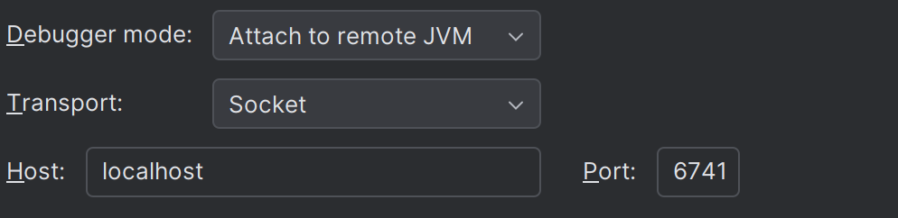

# Debugging your app

There is an issue while you are developing your game such as your code is
a bit funky, and you cannot seem to point it out yourself. Well there is no 
need to fret. The eucalyptus-editor has a `jdb` enabled. 

## How to connect

You have two options, you can either use the command line [`jdb`] or 
IntelliJ IDEA, which has Java Debugging available as one of its tasks. 

In common, you would have to connect to this: 
- IP Address: localhost
- Port: 6741 *(haha very funny im so much comedian)*

### jdb

To connect to jdb, this is the recommended command: 

```bash
jdb -connect com.sun.jdi.SocketAttach:hostname=localhost,port=6741
```

[//]: # (Don't ask why, but this one just works for me)

### IntelliJ IDEA

JetBrains IntelliJ IDEA is the best and recommended tool to use
while in development. It contains debugging tools in a UI fashion,
so it could help beginners too. 

Here is the configuration:


---
Enjoy your debugging and hopefully you solve all your issues. 