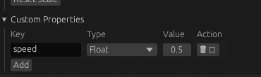

# Different variable types

You might ask: What is the purpose of this article? Doesn't Kotlin already deal with different ways to state variables?
Well yes, but there is a different type used only by the eucalyptus editor: `entity.getProperty()` and 
`entity.setProperty()`.

## Usage

For example, let's say that you have speed, but you don't want to have to deal with the hassle of entering into 
Play Mode, checking your changes, exiting out and editing your code, only to be hit with a 30 second gradle build.

In the eucalyptus editor, this can be seen in an entities `Custom Properties` component, as shown:



In this example, I am using speed to control my player. 

```kotlin
@Runnable(["player"])
class Player: System() {
    override fun load(engine: DropbearEngine) {
        Logger.info("Initialised Player")
    }
    
    override fun update(engine: DropbearEngine, deltaTime: Double) {
        gettingPropertyExample()
        settingPropertyExample()
    }
    
    fun gettingPropertyExample(engine: DropbearEngine, deltaTime: Double) {
        val player = engine.getEntity("player") ?: return // fetches EntityRef of "player" entity
        val speed = player.getProperty<Float>("speed") ?: return // fetches the speed property
        val transform = player.getTransform() ?: return // fetches the transform component of the player
        transform.position += transform.forward * speed * deltaTime // moves the player forward based on speed
        player.setTransform(transform)
    }
    
    fun settingPropertyExample(engine: DropbearEngine, deltaTime: Double) {
        val player = engine.getEntity("player") ?: return // fetches EntityRef of "player" entity
        player.setProperty("speed", 10f) // sets the speed property to 10
    }
}
```

Alternatively, you can hot-mutate values in the editor, which can make the build process easier. Try out the 
custom properties component in the eucalyptus editor. 

Enjoy your new profound knowledge about easily testing your variables :)
